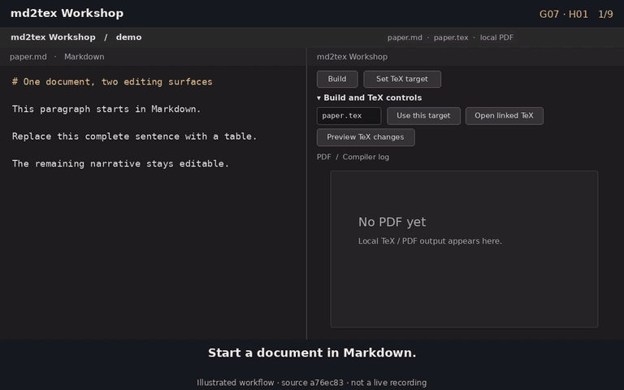

# Obsidian md2tex Workshop

**Persistent Markdown ↔ LaTeX editing for Obsidian.**

An Obsidian plugin for seamless interconversion between Markdown and LaTeX documents.

Existing plugins already allow easy Markdown to LaTeX conversion, which you can then use as a standalone `.tex` file for your projects. But what if you want to mantain the `.md` and the `.tex` file simulataneously when either of them can be edited ? This plugins allows you to solve this problem. 


Keep Markdown as your everyday drafting surface and a working TeX document beside it. Compile locally to PDF, edit supported TeX where TeX is useful, preview the proposed Markdown as a patch, and apply it explicitly—without silently replacing either side. It also comes with a overleaf like side panel for viewing the compiled .pdf. 

>> **Extremely useful for those of us who love the in-place compilation of obsidian for drafting research articles, rather than to read raw latex untill its compiled.**



_Illustrated workflow, exact layout may evolve._

## One document, two editing surfaces

```text
Markdown note ── Build ──► linked TeX ──► PDF
      ▲                         │ edit TeX
      └────◄─  Apply edit to  ◄─┘
               Markdown
                    
```

**Design Philosophy :** Some things make sense in .tex, a few other makes sense in .md, thus no need to interconvert everything from on to other. Here we convert what make sense across boundaries, what does not is treated as un-editable islands, that preserve information about unconverted artifcats through interconversions. 


### Review before writing back

TeX edits return through a read-only **Preview** and a separate **Apply to Markdown** action. The review shows a unified red/green patch; freshness checks, backups, native save, and disk readback guard the write.

### Keep exact TeX where translation would lose meaning

A complex top-level table, figure, or custom environment can become a managed **TeX-owned slot**. Markdown keeps a stable generated pointer while the linked state retains the exact TeX payload for later builds. Keep that state with the document.

### Refuse ambiguous changes

Changed anchors, stale previews, conflicting edits, missing slot pointers, and unsafe inverses stop before overwrite. Both sources and the retained evidence remain available for inspection.

This is a bounded editing workflow, not automatic synchronization or an arbitrary-manuscript importer. Read [the workflow explanation](docs/explanations.md), [round-trip guarantees](docs/roundtrip.md), and [linked-target contract](docs/linked-tex.md) for the precise scope.

## Try the source checkout

Version 0.1.3 is a Linux-first beta candidate. A matching hosted BRAT release has not been published; the latest public release is the older source-only v0.1.0. Local packaging and native testing do not establish the hosted installation path.

With **Node.js 24+**, `latexmk`, and the TeX packages used by the selected recipe, run these commands from the repository root:

```sh
node scripts/workshop.cjs doctor
node scripts/workshop.cjs build examples/quickstart/note.md --out-dir tmp/quickstart-builds
```

For a local three-file Obsidian candidate, follow [the BRAT packaging guide](docs/brat.md). Packaging creates `main.js`, `manifest.json`, and `styles.css`; it does not publish or install them.

## Explore the workflows

| Workflow | Runnable example |
| --- | --- |
| Guarded TeX → Markdown review | [Guarded round trip](examples/claims/04-guarded-round-trip.md) |
| Exact TeX behind a stable Markdown pointer | [TeX-owned slot](examples/claims/06-tex-owned-slot.md) |
| Editable equations, tables, and structured floats | [Native structured recovery](examples/claims/07-native-structured-roundtrip.md) |

The [claim-demo index](examples/claims/README.md) covers local PDF builds, note-owned recipes, label insertion, and the complete seven-example set. The [feature catalogue](docs/features.md) separates implemented behavior from later work.

## Develop or hand the project to an agent

The CLI and Obsidian adapter share `src/core/`. Start with [AGENTS.md](AGENTS.md), [the architecture](docs/architecture.md), and `npm run test:fast`. Keep grammar changes paired with forward and reverse tests.

Give an agent [AGENT_SETUP.md](AGENT_SETUP.md). Require it to inspect prerequisites and use a disposable example before changing a note, installing tools, or deploying the plugin.

Project-owned source and documentation are licensed under [Apache-2.0](LICENSE). Bundled third-party assets retain their own licenses and attribution; see [THIRD_PARTY_NOTICES.md](THIRD_PARTY_NOTICES.md).
