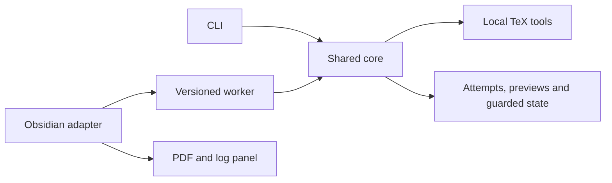

# Architecture and development boundaries

The CLI and desktop adapter call one compiler and one guarded round-trip core.
Markdown rendering belongs to the user's Markdown viewer. The project supplies
an authoring subset and conversion, not a replacement viewer.

| Module | Owns | Does not own |
| --- | --- | --- |
| `scripts/workshop.cjs` | Arguments, JSON output, process exit contract | Rendering or duplicated compiler policy |
| `src/core/config.cjs`, `snapshot.cjs` | Explicit recipe and captured source | Editor state or implicit vault discovery |
| `markdown.cjs`, `reverse.cjs`, `reconcile.cjs` | Forward grammar, exact inverse candidates and conservative reconciliation | Arbitrary TeX interpretation |
| `workshop.cjs`, `process.cjs`, `diagnostics.cjs` | Isolated compilation, tool limits and audited results | User-facing editor transactions |
| `roundtrip.cjs`, `targets.cjs` | Checkpoints, ownership, freshness, backups and approved disk apply | Bypassing an actively edited source |
| `protocol.cjs`, `jobs.cjs`, `capabilities.cjs` | Worker framing, snapshots, runtime identity and capabilities | AI providers |
| `src/obsidian/` | Capture, queue, client transport and output view | A second syntax or compiler implementation |
| `scripts/lib/public-release.cjs` | Explicit public selection and verified fresh source artifact | Updating Git history or publication |
| `scripts/lib/plugin-package.cjs` | Complete private package staging and reviewed installation | Standard Community Plugin artifact delivery |

A persistent TeX target and its checkpoint are shared mutable state. TeX edits
must be reconciled before a new publication; recovery candidates must exactly
regenerate the reviewed TeX or preserve it as an explicit raw island. Refuse
ambiguous recovery instead of losing Markdown-only information.

AI repair remains unimplemented. Its eventual provider boundary may return a
bounded syntax proposal. Deterministic context preparation, schema validation,
compilation and guarded acceptance remain outside that boundary. Disabled AI
must make zero provider calls. API and local-agent routes should implement the
same proposal interface, with no authority over executables or source writes.

Next delivery order: portable public CLI candidate; reviewed GitHub source
release; standard plugin packaging; native desktop beta; then editor-aware
apply and optional repair. Tables require paired conversion/recovery tests;
figures and broader profiles remain separate increments.
