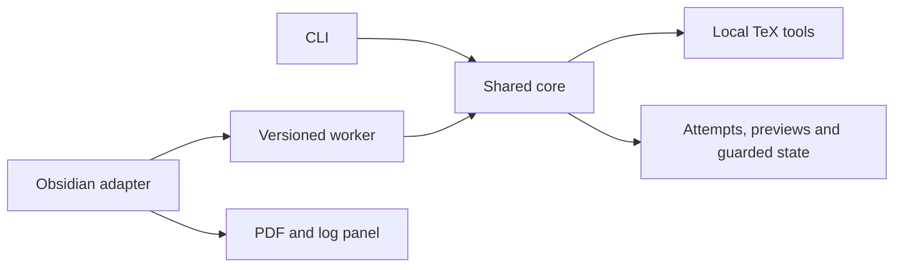

# Architecture and development boundaries

The CLI and desktop adapter call one compiler and one guarded round-trip core. Markdown rendering belongs to the user's Markdown viewer. The project supplies an authoring subset and conversion, not a replacement viewer.

```mermaid
flowchart LR
    CLI[CLI] --> CORE[Shared core]
    OBS[Obsidian adapter] --> WORKER[Versioned worker]
    WORKER --> CORE
    CORE --> TEX[Local TeX tools]
    CORE --> STATE[Attempts, previews and guarded state]
    OBS --> VIEW[PDF and log panel]
```

| Module | Owns | Does not own |
| --- | --- | --- |
| `scripts/workshop.cjs` | Arguments, JSON output, process exit contract | Rendering or duplicated compiler policy |
| `src/core/config.cjs`, `snapshot.cjs` | Explicit recipe and captured source | Editor state or implicit vault discovery |
| `markdown.cjs`, `reverse.cjs`, `reconcile.cjs` | Forward grammar, exact inverse candidates and conservative reconciliation | Arbitrary TeX interpretation |
| `bibliography.cjs` | Resource insertion, one print location and backend-independent body representation | File discovery or raw-command expansion |
| `workshop.cjs`, `process.cjs`, `diagnostics.cjs` | Isolated compilation, tool limits and audited results | User-facing editor transactions |
| `roundtrip.cjs`, `targets.cjs` | Checkpoints, prepared changes, ownership, freshness, backups and the legacy disk adapter | Host editor or vault transactions |
| `protocol.cjs`, `jobs.cjs`, `capabilities.cjs` | Worker framing, snapshots, runtime identity and capabilities | AI providers |
| `failure-packet.cjs`, `failure-record.cjs` | Bounded local evidence from retained attempts and request-bound worker/startup failures | Provider calls, live-note reads or source writes |
| `explanation-contract.cjs` | Pure packet/response validation, identity and evidence-reference checks | Truth certification, UI rendering, dispatch or executable actions |
| `agent-dispatch.cjs`, `agent-process.cjs` | Explicit trusted custom-wrapper invocation and bounded process capture | Compilation, source writes, verified isolation or automatic dispatch |
| `src/obsidian/` | Capture, queue, client transport, guarded source-write adapters and output views | A second syntax or unchecked source writes |
| `scripts/lib/public-release.cjs` | Explicit public selection and verified fresh source artifact | Updating Git history or publication |
| `scripts/lib/plugin-package.cjs`, `brat-package.cjs` | Complete-directory staging, guarded installation and three-file release candidates | Native acceptance or publication |

A persistent TeX target and its checkpoint are shared mutable state. TeX edits must be reconciled before a new publication; recovery candidates must exactly regenerate the reviewed TeX or preserve it as an explicit raw island. Refuse ambiguous recovery instead of losing Markdown-only information.

Ordinary configuration resolves YAML, then control fallbacks, then the basic article default. `buildFrozen` is an internal core entry for verified checkpoint recipes; serialized CLI/worker inputs cannot select it. It bypasses live YAML dependency resolution while preserving candidate syntax validation. Both routes use the same compiler and bibliography assembly. Recipe metadata edits require explicit reconciliation and a fresh checkpoint.

The deterministic [failure-packet reader](failure-packets.md) prepares local evidence from retained attempts and desktop jobs, including startup and target-publication failures. The pure [response validator](explanations.md) accepts bounded text tied to the expected packet and supplied evidence. A manual [trusted local-agent bridge](agent-bridge.md) now supplies untrusted replies through the same validator; automatic agent dispatch and restricted isolation remain unimplemented. The beta agent boundary is explanation-only; a later proposal interface may supply candidate edits to a separate guarded acceptance path. Disabled AI must make zero provider calls. API and local-agent routes must share bounded contracts without authority over executables or source writes.

The public CLI and three-file plugin candidates are implemented. Guarded editor-aware apply now supports a closed saved note or exactly one open editor; additional views are refused. Remaining beta work includes native acceptance of that apply path, restricted agent isolation, named provider adapters, automatic explanation dispatch and UI attachment. Standalone CLI failures before an attempt and failures before request capture retain their existing diagnostic-only route. AI-proposed editing follows the beta. Figures and broader conversion profiles remain separate increments with paired conversion/recovery tests.
